# Web-based SSH Client
## Mobile-First SSH Terminal in the Browser

---

## Overview

This project implements a **web-based SSH client** that runs on Kubernetes locally and is accessible from the internet. Users can connect to their computers via SSH through a mobile-friendly browser interface without needing native SSH clients installed on their devices.

The application acts as an **SSH proxy bridge**, handling SSH connections on the backend while providing a modern terminal emulator interface through WebSocket communication.

---

## Core Concept

```mermaid
graph LR
    subgraph Internet
        Mobile[📱 Mobile Browser]
        Tablet[💻 Tablet Browser]
        Desktop[🖥️ Desktop Browser]
    end
    
    subgraph HomeNetwork[Home Network]
        subgraph K8s[Kubernetes Cluster]
            WebApp[🌐 Web SSH Client]
        end
        
        subgraph Machines[Target Machines]
            Computer1[💻 Personal Computer]
            Server1[🖥️ Home Server]
            RaspPi[🔧 Raspberry Pi]
        end
    end
    
    Mobile -.->|HTTPS/WSS| WebApp
    Tablet -.->|HTTPS/WSS| WebApp  
    Desktop -.->|HTTPS/WSS| WebApp
    
    WebApp -->|SSH Protocol| Computer1
    WebApp -->|SSH Protocol| Server1
    WebApp -->|SSH Protocol| RaspPi
    
    classDef mobile fill:#e1f5fe,stroke:#01579b,stroke-width:2px
    classDef webapp fill:#f3e5f5,stroke:#4a148c,stroke-width:2px
    classDef target fill:#e8f5e8,stroke:#1b5e20,stroke-width:2px
    
    class Mobile,Tablet,Desktop mobile
    class WebApp webapp
    class Computer1,Server1,RaspPi target
```

---

## Use Cases

### Primary Use Cases
1. **Mobile SSH Access** - Control your computer from your phone while away from home
2. **Cross-Platform Terminal** - Access SSH without installing clients on various devices
3. **Emergency Remote Access** - Quickly access your machines from any browser
4. **Development on the Go** - Code and manage servers from mobile devices
5. **IoT Device Management** - Manage Raspberry Pi and other devices through a consistent interface

### Bonus Feature
6. **Group SSH Chat** - Shared SSH session where multiple users can collaborate in real-time (with access key)

---

## Architecture Overview

```mermaid
graph TD
    subgraph Browser[Browser Client]
        UI[📱 Mobile-First Terminal UI]
        XTerm[xterm.js Terminal Emulator]
        WS[WebSocket Client]
    end
    
    subgraph K8s[Kubernetes Cluster]
        subgraph Pod[SSH Client Pod]
            HTTP[HTTP Static Server]
            WSHandler[WebSocket Handler]
            SSHProxy[SSH Connection Manager]
            Auth[Authentication Service]
        end
        
        subgraph Services[K8s Services]
            Ingress[Ingress Controller]
            Service[ClusterIP Service]
        end
    end
    
    subgraph Network[Home Network]
        Router[Router + Port Forward]
        TargetSSH[SSH Server on Target Machine]
    end
    
    UI --> XTerm
    XTerm --> WS
    WS <-->|WSS| Ingress
    Ingress --> Service
    Service --> HTTP
    Service --> WSHandler
    WSHandler --> Auth
    WSHandler --> SSHProxy
    SSHProxy <-->|SSH Protocol| TargetSSH
    
    Router -.->|Port Forward 443| Ingress
```

---

## Detailed Flow Diagram

```mermaid
sequenceDiagram
    participant Mobile as 📱 Mobile Browser
    participant K8s as 🚀 K8s Web App
    participant SSH as 💻 Target SSH Server
    
    Note over Mobile,SSH: Initial Connection & Authentication
    Mobile->>K8s: HTTPS GET / (Load UI)
    K8s-->>Mobile: Return mobile-first terminal UI
    
    Mobile->>K8s: WebSocket handshake + auth token
    K8s-->>Mobile: WebSocket connection established
    
    Note over Mobile,SSH: SSH Connection Setup
    Mobile->>K8s: SSH credentials {host, user, pass/key}
    K8s->>SSH: Establish SSH connection
    SSH-->>K8s: SSH session ready
    K8s-->>Mobile: Connection successful
    
    Note over Mobile,SSH: Terminal Interaction Loop
    loop Command Execution
        Mobile->>K8s: User input (commands, keystrokes)
        K8s->>SSH: Forward to SSH session
        SSH-->>K8s: Command output + ANSI codes
        K8s-->>Mobile: Stream output to terminal
        Mobile->>Mobile: Render in xterm.js
    end
    
    Note over Mobile,SSH: Session Management
    alt Session Timeout
        K8s->>SSH: Close SSH connection
        K8s->>Mobile: Notify session ended
    else User Disconnect
        Mobile->>K8s: Close WebSocket
        K8s->>SSH: Cleanup SSH session
    end
```

---

## Mobile-First UI Design

---

## Security Architecture

```mermaid
graph TD
    subgraph External[🌐 Internet Threats]
        Attacker[Malicious User]
        MITM[Man-in-the-Middle]
        Scanner[Port Scanner]
    end
    
    subgraph Protection[🛡️ Security Layers]
        TLS[TLS/HTTPS Encryption]
        Auth[Token Authentication]
        RateLimit[Rate Limiting]
        IPFilter[IP Filtering]
    end
    
    subgraph K8sApp[🚀 K8s Application]
        Ingress[TLS Termination]
        WebApp[Web SSH Client]
        SSHManager[SSH Session Manager]
    end
    
    subgraph HomeNet[🏠 Home Network]
        Firewall[Router Firewall]
        SSHServer[SSH Server]
    end
    
    Attacker -->|Blocked by| TLS
    MITM -->|Blocked by| TLS
    Scanner -->|Blocked by| IPFilter
    
    TLS --> Ingress
    Auth --> WebApp
    RateLimit --> WebApp
    IPFilter --> Ingress
    
    Ingress --> WebApp
    WebApp --> SSHManager
    SSHManager -->|Through Firewall| SSHServer
    
    classDef threat fill:#ffebee,stroke:#c62828,stroke-width:2px
    classDef security fill:#e8f5e8,stroke:#2e7d32,stroke-width:2px
    classDef app fill:#f3e5f5,stroke:#7b1fa2,stroke-width:2px
    
    class Attacker,MITM,Scanner threat
    class TLS,Auth,RateLimit,IPFilter,Firewall security
    class Ingress,WebApp,SSHManager,SSHServer app
```

---

## Kubernetes Deployment Architecture

---

## Bonus Feature: Group SSH Chat

```mermaid
graph TD
    subgraph Users[Multiple Users]
        User1[👤 User 1 Mobile]
        User2[👤 User 2 Tablet] 
        User3[👤 User 3 Desktop]
    end
    
    subgraph SharedSession[Shared SSH Session]
        SessionManager[Session Manager]
        SharedTerminal[Shared Terminal Buffer]
        CommandFilter[Command Filter]
        AccessControl[Access Key Validation]
    end
    
    subgraph TargetSystem[Target SSH Server]
        SharedServer[Shared Development Server]
    end
    
    User1 <-->|Access Key Auth| AccessControl
    User2 <-->|Access Key Auth| AccessControl
    User3 <-->|Access Key Auth| AccessControl
    
    AccessControl --> SessionManager
    SessionManager <--> SharedTerminal
    SessionManager <--> CommandFilter
    
    CommandFilter <-->|Filtered Commands| SharedServer
    
    SharedTerminal -.->|Broadcast Output| User1
    SharedTerminal -.->|Broadcast Output| User2
    SharedTerminal -.->|Broadcast Output| User3
    
    classDef user fill:#e1f5fe,stroke:#01579b,stroke-width:2px
    classDef session fill:#f3e5f5,stroke:#6a1b9a,stroke-width:2px
    classDef target fill:#e8f5e8,stroke:#2e7d32,stroke-width:2px
    
    class User1,User2,User3 user
    class SessionManager,SharedTerminal,CommandFilter,AccessControl session
    class SharedServer target
```

---

## Technical Stack

### Backend (Go)
- **SSH Client**: `golang.org/x/crypto/ssh`
- **WebSocket**: `github.com/gorilla/websocket`
- **HTTP Server**: `net/http` (standard library)
- **Authentication**: JWT tokens or similar
- **Kubernetes**: Standard Go K8s client libraries

### Frontend
- **Terminal Emulator**: `xterm.js` + addons
- **Styling**: Tailwind CSS (mobile-first)
- **Build Tool**: Vite or similar for optimized mobile delivery
- **PWA Support**: Service workers for offline capability

### Infrastructure  
- **Container**: Docker with multi-stage builds
- **Orchestration**: Kubernetes (local cluster)
- **Ingress**: nginx-ingress or traefik
- **TLS**: Let's Encrypt or self-signed certificates

---

## Implementation Phases

### Phase 1: Core SSH Proxy (MVP)
- ✅ Basic SSH connection management
- ✅ WebSocket bidirectional communication  
- ✅ Simple terminal UI with xterm.js
- ✅ Mobile-responsive interface

### Phase 2: Production Ready
- ✅ Kubernetes deployment manifests
- ✅ TLS/HTTPS support
- ✅ Authentication system
- ✅ Connection management (reconnect, timeouts)

### Phase 3: Mobile Optimization
- ✅ PWA implementation
- ✅ Touch-optimized controls
- ✅ Virtual keyboard enhancements
- ✅ Gesture support

### Phase 4: Bonus Features
- ✅ Group SSH chat functionality
- ✅ Access key management
- ✅ Command filtering for shared sessions
- ✅ Session recording/playback

---

## Key Benefits

🚀 **Accessibility**: SSH access from any device with a browser  
📱 **Mobile-First**: Optimized for phone and tablet usage  
🔒 **Secure**: TLS encryption + authentication  
⚡ **Fast**: Low-latency WebSocket communication  
🎯 **Simple**: No client installation required  
🔄 **Scalable**: Kubernetes-native deployment  
👥 **Collaborative**: Optional shared sessions
