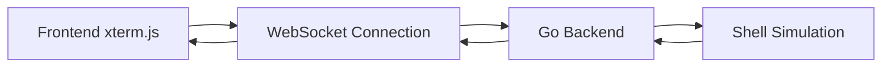
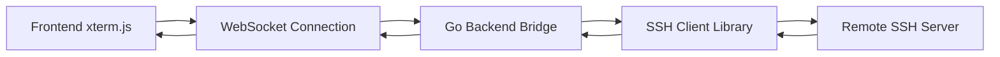
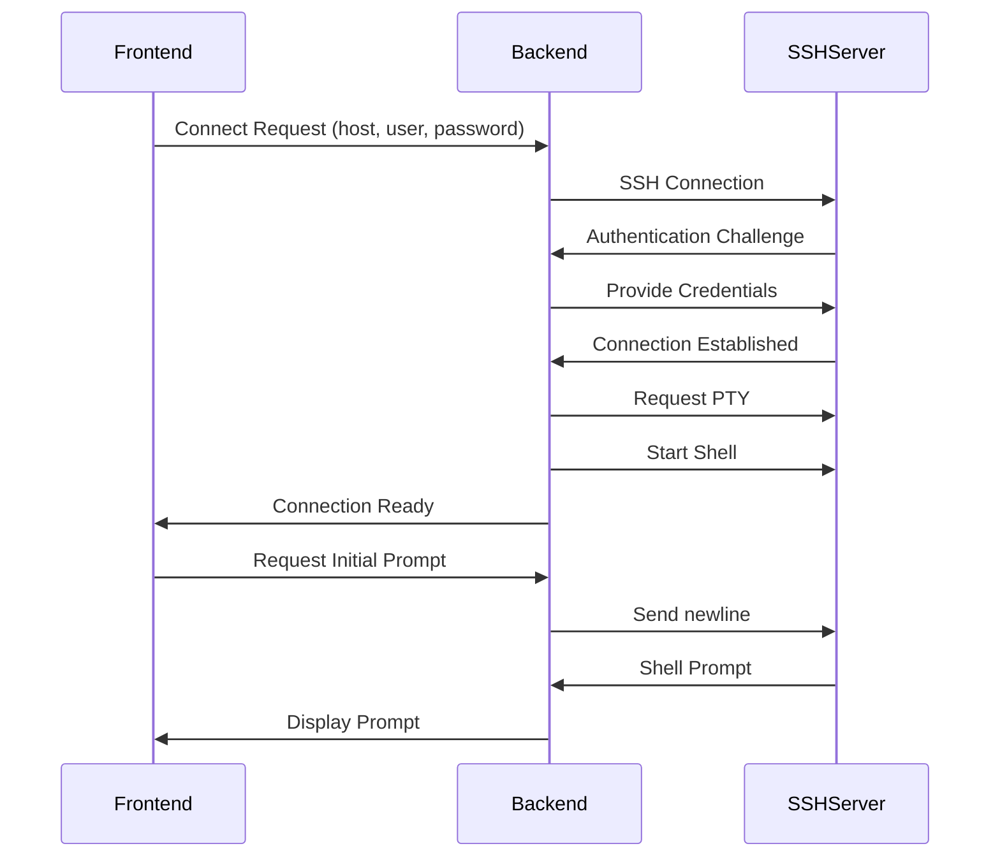
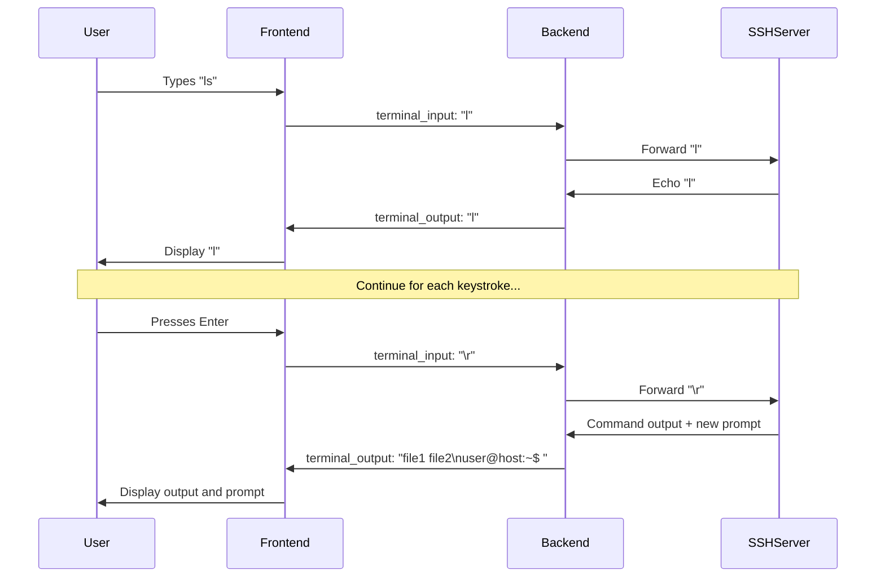

# SSH Implementation Guide

This document outlines the technical architecture and patterns needed to integrate real SSH functionality into the web-based SSH client, replacing the current shell simulation.

## Current Architecture (Simulation)



## Target Architecture (Real SSH)



---

## SSH Integration Strategy

### 1. Backend as Pure Bridge Pattern ✅ **RECOMMENDED**

The Go backend should act as a **transparent bridge** between the WebSocket and SSH connection. This is the cleanest and most maintainable approach.

#### What the Backend Should Handle:
- ✅ WebSocket ↔ SSH data forwarding
- ✅ SSH connection establishment
- ✅ SSH authentication (password/key)
- ✅ Terminal resize events (pty size)
- ✅ Connection lifecycle management
- ✅ Error handling and reconnection

#### What the Backend Should NOT Handle:
- ❌ Command parsing or interpretation
- ❌ Shell history management
- ❌ Command completion logic
- ❌ Terminal state or cursor position
- ❌ ANSI escape sequence processing

---

## State Management Responsibility

### SSH Server Handles ✅
- **Conversation State**: SSH server maintains all session state
- **Command History**: Shell history (↑/↓ arrows) handled by remote shell
- **Line Editing**: Ctrl+A, Ctrl+E, backspace, etc. handled by remote shell
- **Tab Completion**: File/command completion handled by remote shell
- **Environment Variables**: All environment maintained on remote server
- **Working Directory**: `cd` commands change directory on remote server
- **Process State**: Background jobs, process management on remote server

### Frontend Handles ✅
- **Display Rendering**: xterm.js renders all output with ANSI colors
- **Input Capture**: Captures keystrokes and sends to backend
- **Terminal Resizing**: Detects browser resize and notifies backend
- **Connection UI**: Shows connection status, errors, reconnection

### Backend Handles ✅
- **Data Bridge**: Forwards data between WebSocket and SSH
- **Connection Management**: Establishes/maintains SSH connections
- **Authentication**: Handles SSH login process
- **PTY Management**: Creates and resizes pseudo-terminal

---

## Implementation Components

### 1. SSH Client Integration (Backend)

**Recommended Library**: `golang.org/x/crypto/ssh`

```go
// Core SSH session structure
type SSHSession struct {
    conn     ssh.Conn
    session  *ssh.Session
    stdin    io.Writer
    stdout   io.Reader
    stderr   io.Reader
    wsConn   *websocket.Conn
}

// Key methods needed:
func (s *SSHSession) Connect(host, user, password string) error
func (s *SSHSession) StartShell() error
func (s *SSHSession) Write(data []byte) error
func (s *SSHSession) ResizePTY(cols, rows int) error
func (s *SSHSession) Close() error
```

### 2. WebSocket Message Types

```go
// Input from frontend to backend
type TerminalInput struct {
    Type string `json:"type"` // "terminal_input"
    Data string `json:"data"` // Raw keystrokes
}

// Resize events from frontend
type TerminalResize struct {
    Type string `json:"type"` // "terminal_resize"
    Cols int    `json:"cols"`
    Rows int    `json:"rows"`
}

// Output from backend to frontend
type TerminalOutput struct {
    Type string `json:"type"` // "terminal_output"
    Data string `json:"data"` // Raw SSH output with ANSI
}

// Connection management
type ConnectionState struct {
    Type    string `json:"type"`  // "connection_state"
    State   string `json:"state"` // "connecting", "connected", "disconnected"
    Message string `json:"message"`
}
```

### 3. Data Flow Implementation

```go
// Backend bridge - core data forwarding
func (s *SSHSession) bridgeSSHToWebSocket() {
    buffer := make([]byte, 4096)
    for {
        n, err := s.stdout.Read(buffer)
        if err != nil {
            // Handle connection error
            return
        }
        
        // Forward raw SSH output to WebSocket
        msg := TerminalOutput{
            Type: "terminal_output",
            Data: string(buffer[:n]),
        }
        s.wsConn.WriteJSON(msg)
    }
}

func (s *SSHSession) bridgeWebSocketToSSH() {
    for {
        var msg TerminalInput
        err := s.wsConn.ReadJSON(&msg)
        if err != nil {
            return
        }
        
        // Forward input directly to SSH
        s.stdin.Write([]byte(msg.Data))
    }
}
```

---

## SSH Connection Lifecycle

### 1. Connection Establishment



### 2. Normal Operation



---

## Authentication Patterns

### Option 1: Password Authentication ✅ **SIMPLE**
```go
config := &ssh.ClientConfig{
    User: username,
    Auth: []ssh.AuthMethod{
        ssh.Password(password),
    },
}
```

### Option 2: Key-Based Authentication ✅ **SECURE**
```go
key, err := ssh.ParsePrivateKey(privateKeyBytes)
config := &ssh.ClientConfig{
    User: username,
    Auth: []ssh.AuthMethod{
        ssh.PublicKeys(key),
    },
}
```

### Option 3: Interactive Authentication ✅ **FLEXIBLE**
```go
config := &ssh.ClientConfig{
    User: username,
    Auth: []ssh.AuthMethod{
        ssh.KeyboardInteractive(keyboardInteractiveChallenge),
        ssh.Password(password),
        ssh.PublicKeys(key),
    },
}
```

---

## Terminal (PTY) Management

### PTY Creation
```go
// Request pseudo-terminal with initial size
err := session.RequestPty("xterm-256color", rows, cols, ssh.TerminalModes{
    ssh.ECHO:          1,     // Enable echoing
    ssh.TTY_OP_ISPEED: 14400, // Input speed
    ssh.TTY_OP_OSPEED: 14400, // Output speed
})
```

### Dynamic Resizing
```go
// Handle resize events from frontend
func (s *SSHSession) ResizePTY(cols, rows int) error {
    return s.session.WindowChange(rows, cols)
}
```

---

## Error Handling & Recovery

### Connection Errors
```go
type ConnectionError struct {
    Type    string // "auth_failed", "connection_refused", "network_error"
    Message string
    Code    int
}

// Send structured error to frontend
func (s *SSHSession) handleConnectionError(err error) {
    var connErr ConnectionError
    
    switch {
    case strings.Contains(err.Error(), "authentication failed"):
        connErr = ConnectionError{"auth_failed", "Invalid credentials", 401}
    case strings.Contains(err.Error(), "connection refused"):
        connErr = ConnectionError{"connection_refused", "Server unavailable", 503}
    default:
        connErr = ConnectionError{"network_error", err.Error(), 500}
    }
    
    // Send to frontend for user display
    s.sendConnectionState("error", connErr.Message)
}
```

### Reconnection Strategy
```go
func (s *SSHSession) maintainConnection() {
    for {
        if s.conn == nil || !s.isConnected() {
            s.reconnect()
        }
        time.Sleep(5 * time.Second)
    }
}
```

---

## Security Considerations

### 1. Host Key Verification ✅ **CRITICAL**
```go
config := &ssh.ClientConfig{
    HostKeyCallback: ssh.FixedHostKey(expectedHostKey),
    // OR for development (INSECURE):
    // HostKeyCallback: ssh.InsecureIgnoreHostKey(),
}
```

### 2. Connection Limits
```go
type SSHProxy struct {
    maxConnections int
    activeConns    map[string]*SSHSession
    rateLimiter    *rate.Limiter
}
```

### 3. Input Validation
```go
// Validate SSH connection parameters
func validateSSHParams(host, user, password string) error {
    if !isValidHostname(host) {
        return errors.New("invalid hostname")
    }
    if !isValidUsername(user) {
        return errors.New("invalid username")
    }
    return nil
}
```

---

## Performance Optimizations

### 1. Connection Pooling
```go
// Reuse SSH connections for multiple sessions
type SSHConnectionPool struct {
    connections map[string]*ssh.Client
    mutex       sync.RWMutex
}
```

### 2. Buffered I/O
```go
// Buffer SSH output to reduce WebSocket messages
type BufferedOutput struct {
    buffer []byte
    timer  *time.Timer
}

func (b *BufferedOutput) flushPeriodically() {
    // Send buffered data every 16ms (60fps)
}
```

---

## Migration Steps

### Phase 1: Replace Shell Simulation ✅
1. Remove `ShellSession` struct
2. Add SSH client library dependency: `go get golang.org/x/crypto/ssh`
3. Implement `SSHSession` struct
4. Update WebSocket handlers to bridge SSH

### Phase 2: Add Authentication UI 🔄
1. Extend frontend with SSH connection form (host, user, password)
2. Add connection management UI
3. Implement host key verification

### Phase 3: Enhanced Features ⏳
1. Private key authentication
2. SSH connection persistence
3. Multiple concurrent sessions
4. File transfer capabilities

---

## Testing Strategy

### Unit Tests
```go
func TestSSHBridge(t *testing.T) {
    // Test SSH connection establishment
    // Test data forwarding both directions
    // Test error handling
    // Test PTY resize
}
```

### Integration Tests
```go
func TestE2ETerminal(t *testing.T) {
    // Start test SSH server
    // Connect via WebSocket
    // Send commands and verify responses
    // Test terminal features (colors, resizing)
}
```

### Load Tests
- Multiple concurrent SSH connections
- High-frequency input/output
- Connection failure recovery

---

## Deployment Considerations

### Docker SSH Access
```dockerfile
# Backend container needs SSH client capabilities
FROM golang:alpine
RUN apk add --no-cache openssh-client
```

### Network Configuration
- Backend needs outbound SSH access (port 22)
- Consider SSH connection timeouts
- Handle NAT/firewall traversal

### Security Hardening
- Restrict SSH destination hosts (whitelist)
- Implement connection timeouts
- Add audit logging for SSH connections
- Use dedicated SSH service account

---

## Summary

The web SSH client implementation follows a **pure bridge pattern** where:

1. **Frontend**: Handles display and input capture only
2. **Backend**: Acts as transparent WebSocket ↔ SSH bridge
3. **SSH Server**: Handles all terminal logic, state, and processing

This architecture is:
- ✅ **Simple**: Minimal complexity in bridge code
- ✅ **Reliable**: SSH server handles all edge cases
- ✅ **Performant**: Direct data forwarding with minimal processing
- ✅ **Compatible**: Works with any SSH server/shell combination
- ✅ **Maintainable**: Clear separation of concerns

The backend becomes a thin layer that just moves bytes between WebSocket and SSH, letting the SSH protocol handle all the complexity of terminal emulation, command processing, and session management.