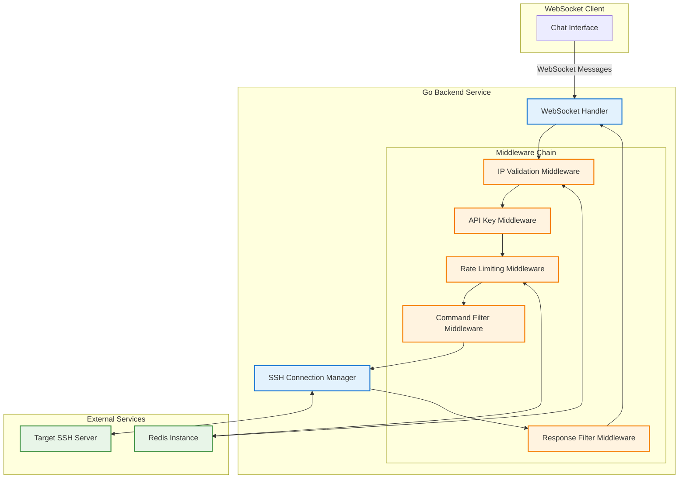
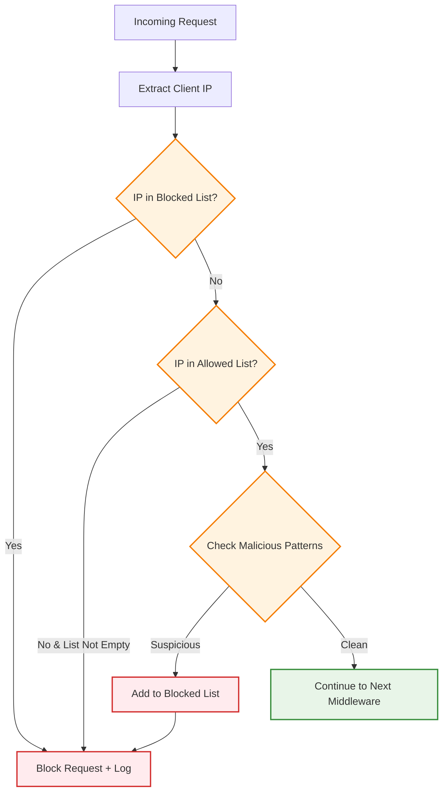
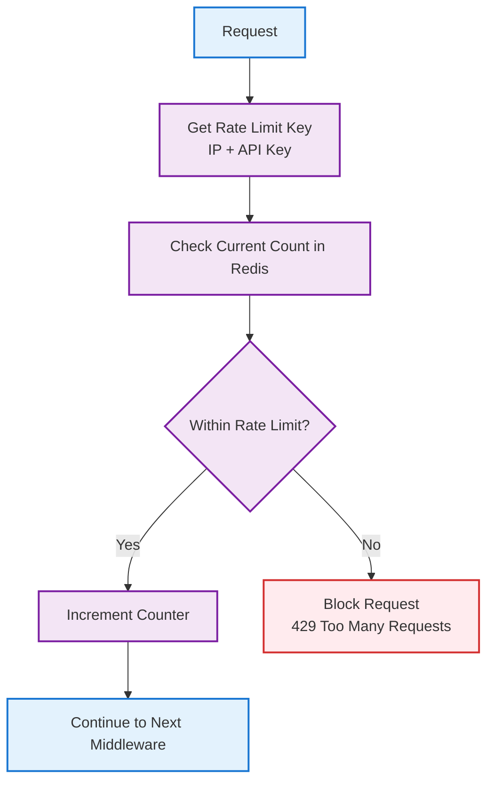
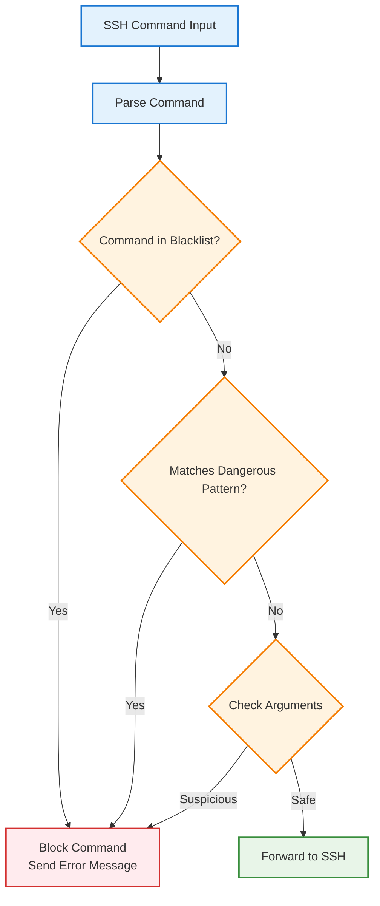
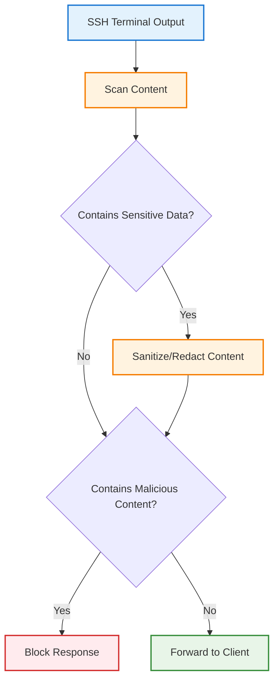

# Web SSH Client Backend Requirements

## Overview

This document defines the technical requirements for the backend service of the web-based SSH client. The backend acts as a secure proxy between WebSocket clients and SSH sessions, implementing multiple security layers and validation mechanisms.

---

## Core Architecture



---

## Functional Requirements

### WebSocket Message Processing
- **Accept WebSocket connections** from chat interface clients
- **Bidirectional message handling** between client and SSH session
- **Real-time streaming** of SSH terminal output to WebSocket clients
- **Input forwarding** from WebSocket to SSH session
- **Connection lifecycle management** (connect, disconnect, cleanup)

### Authentication & Authorization
- **API Key validation** for initial access control
- **Single API key model** (no multi-user authentication needed)
- **Pre-chat screen authentication** - chat interface only accessible with valid API key
- **Session-based access** - API key required for WebSocket connection establishment

### Security Middleware Chain
- **IP Validation** - Allow/block lists with malicious IP detection
- **Rate Limiting** - Prevent abuse and DOS attacks
- **Command Filtering** - Blacklist dangerous commands before SSH execution
- **Response Filtering** - Sanitize SSH responses before sending to client

### SSH Connection Management
- **SSH session establishment** and termination
- **Multiple concurrent sessions** support (if needed)
- **SSH authentication handling** (password/key-based)
- **Connection state monitoring** and cleanup

---

## Technical Requirements

### 1. WebSocket Handler

```go
// WebSocket message types
type MessageType string

const (
    TerminalInput   MessageType = "terminal_input"
    TerminalOutput  MessageType = "terminal_output"
    SystemMessage   MessageType = "system_message"
    ConnectionState MessageType = "connection_state"
)

type WebSocketMessage struct {
    Type      MessageType `json:"type"`
    Data      string      `json:"data"`
    Timestamp time.Time   `json:"timestamp"`
    SessionID string      `json:"session_id,omitempty"`
}
```

**Requirements:**
- Handle WebSocket upgrade with proper error handling
- Parse incoming JSON messages with validation
- Route messages through middleware chain
- Broadcast SSH output to connected clients
- Implement connection keepalive and heartbeat

### 2. IP Validation Middleware



**Requirements:**
- **IP Allow List**: Optional whitelist of trusted IPs
- **IP Block List**: Permanent and temporary blocked IPs
- **Malicious Detection**: Pattern-based suspicious behavior detection
- **Dynamic Blocking**: Automatically block IPs showing malicious patterns
- **Redis Integration**: Store IP lists and detection counters
- **Logging**: Security events for monitoring

**Malicious IP Detection Patterns:**
- Multiple failed API key attempts
- Rapid connection attempts (rate limiting violations)
- Suspicious User-Agent patterns
- Geographic anomalies (optional with GeoIP)

### 3. API Key Middleware

```go
type APIKeyConfig struct {
    HeaderName   string        // Default: "X-API-Key"
    ValidKey     string        // Single valid API key
    CacheTimeout time.Duration // Redis cache timeout for key validation
}
```

**Requirements:**
- **Header Validation**: Check for API key in HTTP headers
- **Single Key Model**: Validate against one configured API key
- **Redis Caching**: Cache validation results to reduce processing
- **WebSocket Authentication**: Validate during WebSocket upgrade
- **Error Responses**: Return appropriate HTTP status codes

### 4. Rate Limiting Middleware



**Requirements:**
- **Redis-based Tracking**: Use Redis for distributed rate limiting
- **Multiple Rate Limits**: Different limits for different endpoints/actions
- **Sliding Window**: Implement sliding window rate limiting algorithm
- **IP-based Limiting**: Rate limit per IP address
- **Configurable Limits**: Easy configuration of rate limit values

**Rate Limit Configuration:**
```go
type RateLimitConfig struct {
    WebSocketConnections int           // Max WebSocket connections per IP per minute
    MessageRate         int           // Max messages per WebSocket per second  
    APIKeyAttempts      int           // Max failed API key attempts per IP per hour
    WindowSize          time.Duration // Rate limiting window size
}
```

### 5. Command Filter Middleware



**Requirements:**
- **Command Blacklist**: Configurable list of blocked commands
- **Pattern Matching**: Regex patterns for dangerous command detection
- **Argument Validation**: Check command arguments for suspicious content
- **Custom Error Messages**: User-friendly error responses for blocked commands
- **Logging**: Security audit trail of blocked commands

**Blacklisted Commands Categories:**
```go
type CommandBlacklist struct {
    SystemCommands    []string // rm, dd, mkfs, fdisk, etc.
    NetworkCommands   []string // nc, nmap, wget malicious URLs, etc.
    ProcessCommands   []string // kill -9, killall, pkill critical processes
    FileCommands      []string // chmod 777, chown root, etc.
    ServiceCommands   []string // systemctl stop, service stop critical services
    CustomBlacklist   []string // User-defined blocked commands
}
```

### 6. Response Filter Middleware



**Requirements:**
- **Sensitive Data Detection**: Scan for passwords, API keys, tokens in output
- **Content Sanitization**: Redact or mask sensitive information
- **Malicious Content Filtering**: Detect potential malicious responses
- **ANSI Code Validation**: Ensure terminal escape sequences are safe
- **Configurable Patterns**: Customizable regex patterns for detection

**Response Filter Patterns:**
```go
type ResponseFilterConfig struct {
    SensitivePatterns []string // Regex patterns for sensitive data
    RedactReplacement string   // Replacement text for sensitive data
    MaxResponseSize   int      // Maximum response size to prevent memory issues
    AllowANSICodes    bool     // Whether to allow ANSI escape codes
}
```

---

## Data Management

### No Persistent Storage
- **Zero Data Retention**: No terminal session data stored permanently
- **In-Memory Processing**: All data processing happens in memory
- **No Database Required**: Stateless backend design
- **Session Cleanup**: Automatic cleanup on disconnect

### Redis Usage
- **Rate Limiting Counters**: Temporary storage for rate limit tracking
- **IP Block Lists**: Dynamic IP blocking with TTL
- **API Key Validation Cache**: Optional caching for performance
- **Malicious IP Detection**: Behavior pattern tracking

**Redis Data Structure:**
```
rate_limit:{ip}:{endpoint} -> counter with TTL
blocked_ips:{ip} -> timestamp with TTL  
malicious_attempts:{ip} -> counter with TTL
api_key_cache:{key_hash} -> validation_result with TTL
```

---

## Security Considerations

### Input Validation
- **WebSocket Message Validation**: JSON schema validation
- **SSH Command Sanitization**: Remove dangerous characters and sequences
- **Parameter Validation**: Validate all input parameters
- **Buffer Overflow Prevention**: Limit message and response sizes

### Error Handling
- **Secure Error Messages**: No sensitive information in error responses
- **Rate Limit Error Handling**: Graceful degradation under load
- **SSH Connection Errors**: Proper cleanup on connection failures
- **Logging**: Comprehensive security event logging

### Connection Security
- **WebSocket Origin Validation**: Validate WebSocket connection origins
- **SSH Connection Encryption**: Ensure SSH connections use proper encryption
- **Memory Management**: Prevent memory leaks in long-running sessions
- **Resource Limits**: CPU and memory limits per connection

---

## Configuration Management

```go
type BackendConfig struct {
    Server struct {
        Port            int
        ReadTimeout     time.Duration
        WriteTimeout    time.Duration
        MaxConnections  int
    }
    
    Security struct {
        APIKey          string
        AllowedIPs      []string
        BlockedIPs      []string
        RateLimit       RateLimitConfig
        CommandFilter   CommandBlacklist
        ResponseFilter  ResponseFilterConfig
    }
    
    Redis struct {
        Address     string
        Password    string
        DB          int
        MaxRetries  int
        PoolSize    int
    }
    
    SSH struct {
        DefaultTimeout  time.Duration
        MaxSessions     int
        KeepaliveInterval time.Duration
    }
}
```

---

## Performance Requirements

- **Low Latency**: <50ms message processing time
- **High Throughput**: Support 100+ concurrent WebSocket connections
- **Memory Efficiency**: <100MB memory usage under normal load
- **CPU Efficiency**: <10% CPU usage with moderate load
- **Redis Performance**: <10ms Redis operation latency

---

## Monitoring & Observability

### Metrics to Track
- **Connection Metrics**: Active WebSocket connections, connection duration
- **Security Metrics**: Blocked commands, blocked IPs, rate limit violations
- **Performance Metrics**: Message processing time, SSH connection latency
- **Error Metrics**: Failed authentications, SSH connection errors

### Logging Requirements
- **Security Events**: Authentication failures, blocked commands, suspicious IPs
- **System Events**: WebSocket connections, SSH session lifecycle
- **Error Events**: All errors with appropriate context
- **Audit Trail**: Command execution history (without storing actual commands)