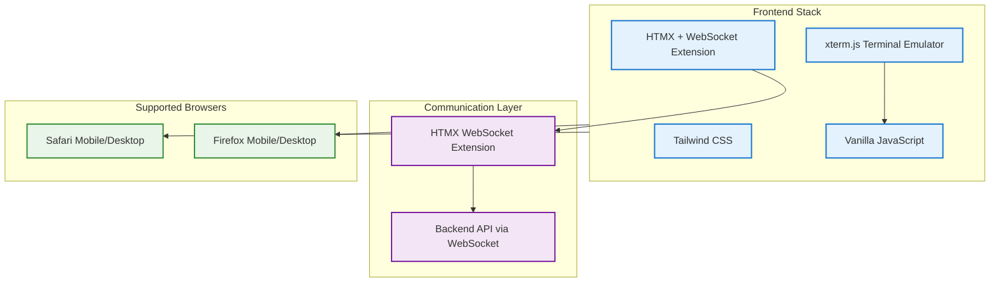
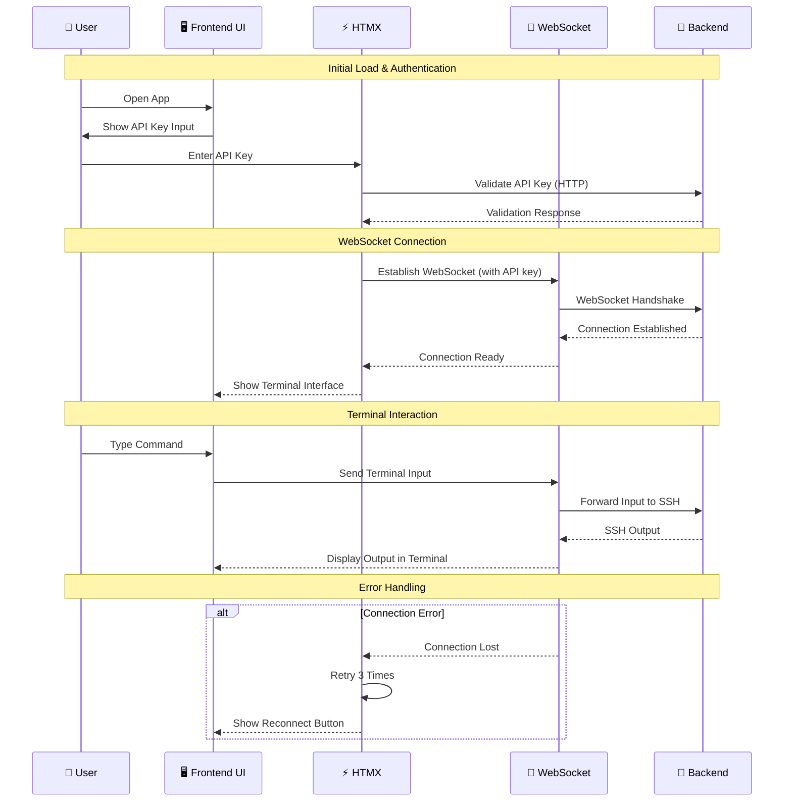
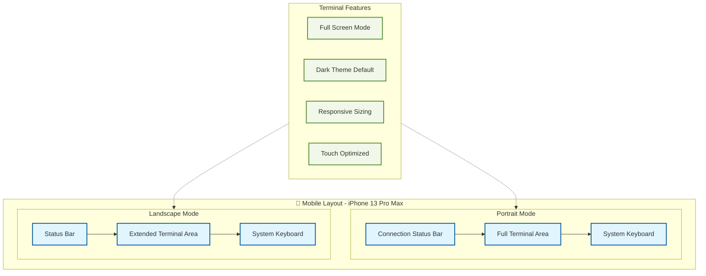
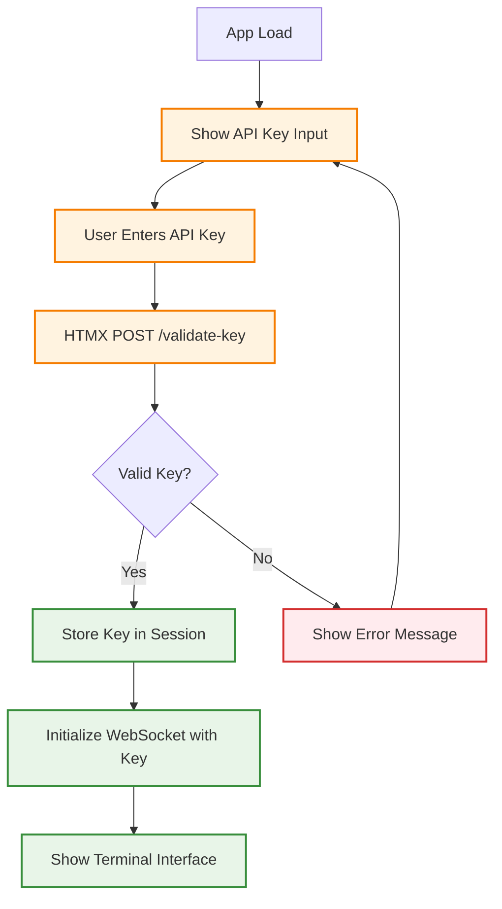
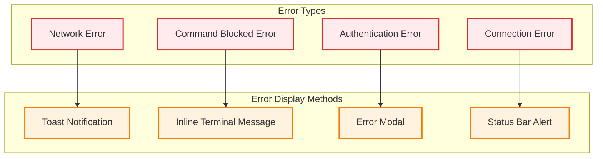

# Web SSH Client Frontend Technical Requirements

## Overview

This document defines the technical requirements for the frontend of the web-based SSH client. The frontend provides a full-screen terminal experience optimized for mobile devices using HTMX, Tailwind CSS, and xterm.js with WebSocket communication.

---

## Technology Stack



---

## Architecture Overview



---

## UI/UX Requirements

### Full-Screen Terminal Experience



### Mobile Optimization Targets

**Primary Target: iPhone 13 Pro Max**
- **Portrait**: 428 × 926 pixels (390 × 844 logical)
- **Landscape**: 926 × 428 pixels (844 × 390 logical)
- **Safe Areas**: Account for notch and home indicator
- **Viewport**: `viewport-fit=cover` for full-screen experience

**Responsive Breakpoints:**
```css
/* Mobile Portrait */
@media (max-width: 428px) and (orientation: portrait)

/* Mobile Landscape */  
@media (max-width: 926px) and (orientation: landscape)

/* Tablet fallback */
@media (min-width: 768px)
```

---

## Technical Implementation

### 1. HTMX WebSocket Integration

```html
<!-- WebSocket Connection Setup -->
<div hx-ext="ws" 
     ws-connect="/ws?api_key={API_KEY}">
  
  <!-- Terminal Container -->
  <div id="terminal-container" 
       ws-send 
       class="h-full w-full">
  </div>
  
  <!-- Status Indicator -->
  <div id="connection-status" 
       hx-swap-oob="true">
    <span class="status-indicator"></span>
  </div>
</div>
```

**WebSocket Message Handling:**
```javascript
// HTMX WebSocket message processing
document.addEventListener('htmx:wsBeforeMessage', function(event) {
    const message = JSON.parse(event.detail.message);
    
    switch(message.type) {
        case 'terminal_output':
            terminal.write(message.data);
            break;
        case 'system_message':
            handleSystemMessage(message);
            break;
        case 'connection_state':
            updateConnectionStatus(message.data);
            break;
    }
});
```

### 2. API Key Authentication Flow



**Authentication UI:**
```html
<!-- API Key Input Screen -->
<div id="auth-screen" class="flex items-center justify-center min-h-screen bg-gray-900">
  <div class="w-full max-w-md p-6">
    <h1 class="text-2xl font-bold text-white mb-6 text-center">SSH Terminal</h1>
    
    <form hx-post="/validate-key" 
          hx-target="#main-app" 
          hx-swap="outerHTML">
      
      <input type="password" 
             name="api_key" 
             placeholder="Enter API Key"
             class="w-full p-3 bg-gray-800 text-white rounded-lg border border-gray-600 focus:border-blue-500"
             autocomplete="off"
             required>
      
      <button type="submit" 
              class="w-full mt-4 p-3 bg-blue-600 text-white rounded-lg hover:bg-blue-700">
        Connect
      </button>
      
      <div id="auth-error" class="mt-4 text-red-400 text-sm hidden"></div>
    </form>
  </div>
</div>
```

### 3. Terminal Implementation (xterm.js)

```javascript
// Terminal Configuration
const terminal = new Terminal({
    theme: {
        background: '#1a1a1a',
        foreground: '#ffffff',
        cursor: '#ffffff',
        cursorAccent: '#000000',
        selection: '#3e4451',
        black: '#1e1e1e',
        red: '#f44747',
        green: '#608b4e',
        yellow: '#dcdcaa',
        blue: '#569cd6',
        magenta: '#c678dd',
        cyan: '#56b6c2',
        white: '#d4d4d4',
        brightBlack: '#808080',
        brightRed: '#f44747',
        brightGreen: '#608b4e',
        brightYellow: '#dcdcaa',
        brightBlue: '#569cd6',
        brightMagenta: '#c678dd',
        brightCyan: '#56b6c2',
        brightWhite: '#ffffff'
    },
    fontFamily: 'Menlo, Monaco, "Courier New", monospace',
    fontSize: 14,
    lineHeight: 1.2,
    cursorBlink: true,
    cursorStyle: 'block',
    scrollback: 1000,
    tabStopWidth: 4
});

// Mobile-specific configuration
if (window.innerWidth <= 428) {
    terminal.setOption('fontSize', 12);
    terminal.setOption('lineHeight', 1.1);
}

// Initialize terminal
terminal.open(document.getElementById('terminal-container'));

// Handle input
terminal.onData(data => {
    // Send via HTMX WebSocket
    htmx.find('[ws-send]').dispatchEvent(
        new CustomEvent('htmx:ws-send', {
            detail: { 
                type: 'terminal_input',
                data: data 
            }
        })
    );
});
```

### 4. Mobile Keyboard Optimization

```javascript
// Mobile keyboard behavior (like chat apps)
class MobileKeyboardHandler {
    constructor(terminal) {
        this.terminal = terminal;
        this.setupMobileKeyboard();
    }
    
    setupMobileKeyboard() {
        // Create hidden input for mobile keyboard
        const hiddenInput = document.createElement('input');
        hiddenInput.type = 'text';
        hiddenInput.style.position = 'absolute';
        hiddenInput.style.left = '-9999px';
        hiddenInput.style.opacity = '0';
        hiddenInput.autocomplete = 'off';
        hiddenInput.autocorrect = 'off';
        hiddenInput.autocapitalize = 'off';
        hiddenInput.spellcheck = false;
        
        document.body.appendChild(hiddenInput);
        
        // Focus hidden input when terminal is tapped
        this.terminal.element.addEventListener('touchstart', () => {
            hiddenInput.focus();
        });
        
        // Handle input from hidden field
        hiddenInput.addEventListener('input', (e) => {
            const value = e.target.value;
            if (value) {
                this.terminal.write(value);
                // Send to backend via WebSocket
                this.sendInput(value);
                hiddenInput.value = '';
            }
        });
        
        // Handle special keys
        hiddenInput.addEventListener('keydown', (e) => {
            switch(e.key) {
                case 'Enter':
                    this.sendInput('\r');
                    break;
                case 'Backspace':
                    this.sendInput('\b');
                    break;
                case 'Tab':
                    e.preventDefault();
                    this.sendInput('\t');
                    break;
            }
        });
    }
    
    sendInput(data) {
        htmx.find('[ws-send]').dispatchEvent(
            new CustomEvent('htmx:ws-send', {
                detail: { 
                    type: 'terminal_input',
                    data: data 
                }
            })
        );
    }
}
```

### 5. Connection Management & Retry Logic

```javascript
// Connection state management
class ConnectionManager {
    constructor() {
        this.retryCount = 0;
        this.maxRetries = 3;
        this.retryDelay = 1000; // Start with 1 second
        this.connectionStatus = 'disconnected';
    }
    
    handleConnectionLost() {
        this.connectionStatus = 'reconnecting';
        this.updateStatusIndicator();
        this.attemptReconnection();
    }
    
    async attemptReconnection() {
        if (this.retryCount < this.maxRetries) {
            this.retryCount++;
            this.showRetrySpinner();
            
            // Exponential backoff
            await this.delay(this.retryDelay * Math.pow(2, this.retryCount - 1));
            
            try {
                // Trigger HTMX WebSocket reconnection
                htmx.find('[hx-ext="ws"]').dispatchEvent(
                    new CustomEvent('htmx:ws-reconnect')
                );
            } catch (error) {
                console.error('Reconnection attempt failed:', error);
                this.attemptReconnection();
            }
        } else {
            this.showReconnectButton();
        }
    }
    
    showRetrySpinner() {
        const statusEl = document.getElementById('connection-status');
        statusEl.innerHTML = `
            <div class="flex items-center text-yellow-400">
                <svg class="animate-spin h-4 w-4 mr-2" viewBox="0 0 24 24">
                    <circle class="opacity-25" cx="12" cy="12" r="10" stroke="currentColor" stroke-width="4" fill="none"></circle>
                    <path class="opacity-75" fill="currentColor" d="M4 12a8 8 0 018-8V0C5.373 0 0 5.373 0 12h4zm2 5.291A7.962 7.962 0 014 12H0c0 3.042 1.135 5.824 3 7.938l3-2.647z"></path>
                </svg>
                Reconnecting... (${this.retryCount}/${this.maxRetries})
            </div>
        `;
    }
    
    showReconnectButton() {
        const statusEl = document.getElementById('connection-status');
        statusEl.innerHTML = `
            <div class="flex items-center text-red-400">
                <span class="mr-2">Connection lost</span>
                <button onclick="location.reload()" 
                        class="px-3 py-1 bg-blue-600 text-white rounded text-sm hover:bg-blue-700">
                    Reconnect
                </button>
            </div>
        `;
    }
    
    updateStatusIndicator() {
        const statusEl = document.getElementById('connection-status');
        const statusClasses = {
            connected: 'bg-green-500',
            reconnecting: 'bg-yellow-500 animate-pulse',
            disconnected: 'bg-red-500'
        };
        
        statusEl.querySelector('.status-indicator').className = 
            `w-2 h-2 rounded-full ${statusClasses[this.connectionStatus]}`;
    }
    
    delay(ms) {
        return new Promise(resolve => setTimeout(resolve, ms));
    }
}
```

### 6. Error Handling & User Feedback



**Error Display Implementation:**
```javascript
class ErrorHandler {
    static showAuthError(message) {
        const errorEl = document.getElementById('auth-error');
        errorEl.textContent = message;
        errorEl.classList.remove('hidden');
        setTimeout(() => errorEl.classList.add('hidden'), 5000);
    }
    
    static showCommandError(command, reason) {
        terminal.writeln(`\r\n\x1b[31mCommand blocked: ${command}\x1b[0m`);
        terminal.writeln(`\x1b[33mReason: ${reason}\x1b[0m\r\n`);
    }
    
    static showNetworkError(message) {
        // Toast notification
        const toast = document.createElement('div');
        toast.className = 'fixed top-4 right-4 bg-red-600 text-white p-4 rounded-lg shadow-lg z-50';
        toast.textContent = message;
        document.body.appendChild(toast);
        
        setTimeout(() => {
            toast.remove();
        }, 5000);
    }
}
```

---

## Responsive Design Specifications

### Tailwind CSS Configuration

```javascript
// tailwind.config.js
module.exports = {
    content: ['./src/**/*.{html,js}'],
    darkMode: 'class',
    theme: {
        extend: {
            screens: {
                'iphone13': '428px',
                'iphone13-landscape': '926px',
            },
            fontFamily: {
                'mono': ['Menlo', 'Monaco', 'Courier New', 'monospace'],
            },
            colors: {
                terminal: {
                    bg: '#1a1a1a',
                    text: '#ffffff',
                    cursor: '#ffffff',
                    selection: '#3e4451',
                }
            }
        }
    }
}
```

### CSS Classes for Mobile Optimization

```css
/* Terminal container */
.terminal-container {
    @apply h-screen w-screen bg-terminal-bg overflow-hidden;
}

/* Mobile portrait */
@screen iphone13 {
    .terminal-container {
        @apply pt-safe-top pb-safe-bottom;
        font-size: 12px;
        line-height: 1.1;
    }
}

/* Mobile landscape */
@media (max-width: 926px) and (orientation: landscape) {
    .terminal-container {
        @apply pl-safe-left pr-safe-right;
        font-size: 11px;
    }
}

/* Safe area handling */
.pt-safe-top { padding-top: env(safe-area-inset-top); }
.pb-safe-bottom { padding-bottom: env(safe-area-inset-bottom); }
.pl-safe-left { padding-left: env(safe-area-inset-left); }
.pr-safe-right { padding-right: env(safe-area-inset-right); }
```

---

## Performance Requirements

### Bundle Size Optimization
- **Total Bundle Size**: <500KB (including all dependencies)
- **Critical CSS**: <50KB for initial render
- **JavaScript**: <300KB total, lazy load non-essential features
- **xterm.js**: Use production build, tree-shake unused features

### Runtime Performance
- **Terminal Rendering**: 60fps on mobile devices
- **WebSocket Latency**: <100ms message processing
- **Memory Usage**: <50MB on mobile browsers
- **Touch Response**: <16ms touch-to-render latency

### Loading Performance
- **First Contentful Paint**: <2 seconds on 3G
- **Time to Interactive**: <3 seconds on mobile
- **Progressive Enhancement**: Core functionality without JavaScript

---

## Browser Compatibility

### Primary Support
- **Safari Mobile**: iOS 14+
- **Safari Desktop**: macOS Big Sur+
- **Firefox Mobile**: Android 90+
- **Firefox Desktop**: Version 90+

### Feature Detection
```javascript
// WebSocket support check
if (!window.WebSocket) {
    ErrorHandler.showNetworkError('WebSocket not supported');
    return;
}

// Touch support detection
const isTouchDevice = 'ontouchstart' in window || navigator.maxTouchPoints > 0;
if (isTouchDevice) {
    new MobileKeyboardHandler(terminal);
}

// HTMX WebSocket extension check
if (!htmx.ext['ws']) {
    console.error('HTMX WebSocket extension not loaded');
}
```

---

## Security Considerations

### Client-Side Security
- **API Key Handling**: Store in sessionStorage, never localStorage
- **WebSocket Origin**: Validate connection origin
- **Input Sanitization**: Sanitize all user inputs before WebSocket transmission
- **CSP Headers**: Implement Content Security Policy

### Privacy Protection
- **No Local Storage**: No persistent storage of terminal data
- **Session Cleanup**: Clear all data on browser close
- **Secure Headers**: X-Frame-Options, X-Content-Type-Options

```javascript
// Secure API key handling
class SecureStorage {
    static setAPIKey(key) {
        sessionStorage.setItem('ssh_api_key', key);
    }
    
    static getAPIKey() {
        return sessionStorage.getItem('ssh_api_key');
    }
    
    static clearAPIKey() {
        sessionStorage.removeItem('ssh_api_key');
    }
}

// Clear on page unload
window.addEventListener('beforeunload', () => {
    SecureStorage.clearAPIKey();
});
```

---

## Testing Requirements

### Manual Testing Checklist
- ✅ API key authentication flow
- ✅ WebSocket connection establishment
- ✅ Terminal input/output functionality
- ✅ Mobile keyboard behavior
- ✅ Connection retry mechanism
- ✅ Error handling for all scenarios
- ✅ Portrait/landscape orientation changes
- ✅ Touch interaction responsiveness

### Automated Testing
- **Unit Tests**: JavaScript utility functions
- **Integration Tests**: HTMX WebSocket communication
- **E2E Tests**: Complete user flows on mobile devices
- **Performance Tests**: Bundle size, rendering performance