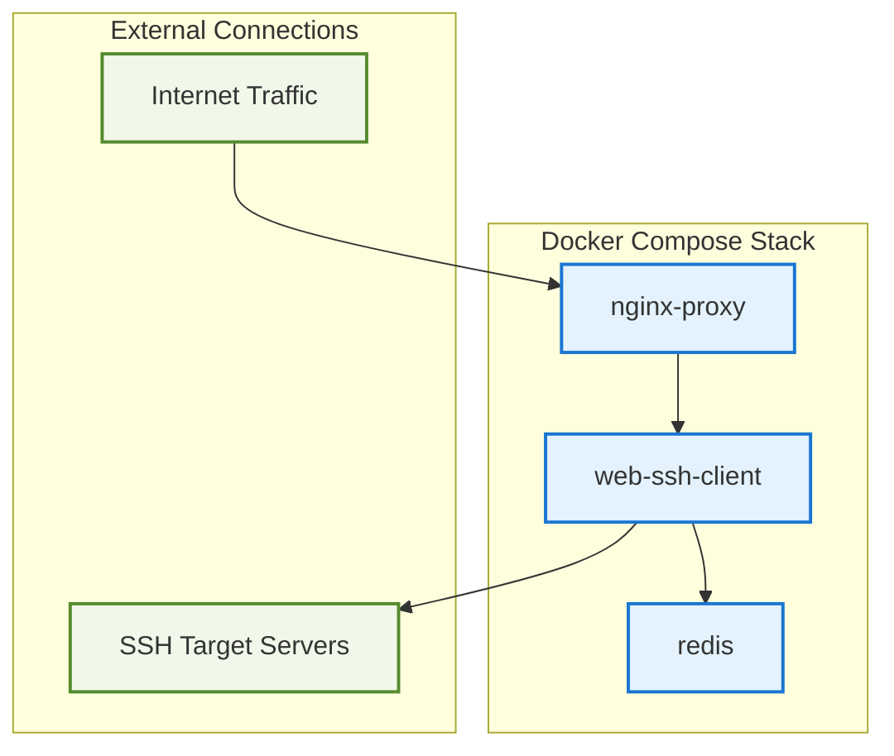

# Infrastructure Reference Guide
## Docker Compose & Kubernetes Configuration for Web SSH Client

---

## Docker Compose Services

### Service Overview



### docker-compose.yml Structure

```yaml
version: '3.9'

services:
  # Main SSH Client Application
  web-ssh-client:
    image: web-ssh-client:latest
    container_name: ssh-client-app
    restart: unless-stopped
    ports:
      - "8080:8080"
    environment:
      - REDIS_URL=redis://redis:6379/0
      - API_KEY=${API_KEY}
      - ALLOWED_IPS=${ALLOWED_IPS}
      - LOG_LEVEL=info
    depends_on:
      - redis
    networks:
      - ssh-network
    volumes:
      - ./logs:/app/logs
    healthcheck:
      test: ["CMD", "wget", "--quiet", "--tries=1", "--spider", "http://localhost:8080/health"]
      interval: 30s
      timeout: 10s
      retries: 3

  # Redis for Rate Limiting & Caching
  redis:
    image: redis:7.2-alpine
    container_name: ssh-client-redis
    restart: unless-stopped
    ports:
      - "6379:6379"
    command: redis-server --appendonly yes --maxmemory 256mb --maxmemory-policy allkeys-lru
    volumes:
      - redis-data:/data
    networks:
      - ssh-network
    healthcheck:
      test: ["CMD", "redis-cli", "ping"]
      interval: 30s
      timeout: 10s
      retries: 3

  # Nginx Reverse Proxy (Optional)
  nginx:
    image: nginx:1.25-alpine
    container_name: ssh-client-nginx
    restart: unless-stopped
    ports:
      - "80:80"
      - "443:443"
    volumes:
      - ./nginx.conf:/etc/nginx/nginx.conf:ro
      - ./ssl:/etc/nginx/ssl:ro
    depends_on:
      - web-ssh-client
    networks:
      - ssh-network

volumes:
  redis-data:
    driver: local

networks:
  ssh-network:
    driver: bridge
```

---

## Environment Variables

### Required Variables

| Variable | Description | Example | Required |
|----------|-------------|---------|----------|
| `API_KEY` | Single API key for authentication | `your-secret-api-key-here` | ✅ |
| `REDIS_URL` | Redis connection string | `redis://redis:6379/0` | ✅ |
| `PORT` | Application port | `8080` | ✅ |

### Security Variables

| Variable | Description | Example | Required |
|----------|-------------|---------|----------|
| `ALLOWED_IPS` | Comma-separated allowed IPs | `192.168.1.0/24,10.0.0.1` | ❌ |
| `BLOCKED_IPS` | Comma-separated blocked IPs | `1.2.3.4,5.6.7.8` | ❌ |
| `TLS_CERT_PATH` | TLS certificate file path | `/app/certs/tls.crt` | ❌ |
| `TLS_KEY_PATH` | TLS private key file path | `/app/certs/tls.key` | ❌ |

### Rate Limiting Variables

| Variable | Description | Default | Required |
|----------|-------------|---------|----------|
| `RATE_LIMIT_CONNECTIONS` | Max WebSocket connections per IP/min | `10` | ❌ |
| `RATE_LIMIT_MESSAGES` | Max messages per connection/sec | `50` | ❌ |
| `RATE_LIMIT_API_ATTEMPTS` | Max failed API attempts per IP/hour | `5` | ❌ |

### Application Variables

| Variable | Description | Default | Required |
|----------|-------------|---------|----------|
| `LOG_LEVEL` | Logging level | `info` | ❌ |
| `SSH_TIMEOUT` | SSH connection timeout | `30s` | ❌ |
| `MAX_SSH_SESSIONS` | Max concurrent SSH sessions | `100` | ❌ |
| `WEBSOCKET_TIMEOUT` | WebSocket timeout | `5m` | ❌ |

### .env File Template

```bash
# === REQUIRED CONFIGURATION ===
API_KEY=your-super-secret-api-key-change-this
REDIS_URL=redis://redis:6379/0
PORT=8080

# === SECURITY CONFIGURATION ===
# ALLOWED_IPS=192.168.1.0/24,10.0.0.0/16
# BLOCKED_IPS=
# TLS_CERT_PATH=/app/certs/tls.crt
# TLS_KEY_PATH=/app/certs/tls.key

# === RATE LIMITING ===
RATE_LIMIT_CONNECTIONS=10
RATE_LIMIT_MESSAGES=50
RATE_LIMIT_API_ATTEMPTS=5

# === APPLICATION SETTINGS ===
LOG_LEVEL=info
SSH_TIMEOUT=30s
MAX_SSH_SESSIONS=100
WEBSOCKET_TIMEOUT=5m

# === REDIS CONFIGURATION ===
REDIS_MAX_RETRIES=3
REDIS_POOL_SIZE=10
```

---

## Kubernetes Configuration Files

### Namespace

```yaml
# namespace.yaml
apiVersion: v1
kind: Namespace
metadata:
  name: web-ssh-client
  labels:
    app.kubernetes.io/name: web-ssh-client
    app.kubernetes.io/version: "1.0.0"
```

### ConfigMap

```yaml
# configmap.yaml
apiVersion: v1
kind: ConfigMap
metadata:
  name: ssh-client-config
  namespace: web-ssh-client
data:
  REDIS_URL: "redis://redis-service:6379/0"
  PORT: "8080"
  LOG_LEVEL: "info"
  SSH_TIMEOUT: "30s"
  MAX_SSH_SESSIONS: "100"
  WEBSOCKET_TIMEOUT: "5m"
  RATE_LIMIT_CONNECTIONS: "10"
  RATE_LIMIT_MESSAGES: "50"
  RATE_LIMIT_API_ATTEMPTS: "5"
  REDIS_MAX_RETRIES: "3"
  REDIS_POOL_SIZE: "10"
```

### Secrets

```yaml
# secrets.yaml
apiVersion: v1
kind: Secret
metadata:
  name: ssh-client-secrets
  namespace: web-ssh-client
type: Opaque
data:
  API_KEY: <base64-encoded-api-key>
  # ALLOWED_IPS: <base64-encoded-allowed-ips>
  # BLOCKED_IPS: <base64-encoded-blocked-ips>
---
apiVersion: v1
kind: Secret
metadata:
  name: tls-secret
  namespace: web-ssh-client
type: kubernetes.io/tls
data:
  tls.crt: <base64-encoded-certificate>
  tls.key: <base64-encoded-private-key>
```

### Redis Deployment

```yaml
# redis-deployment.yaml
apiVersion: apps/v1
kind: Deployment
metadata:
  name: redis-deployment
  namespace: web-ssh-client
  labels:
    app: redis
spec:
  replicas: 1
  selector:
    matchLabels:
      app: redis
  template:
    metadata:
      labels:
        app: redis
    spec:
      containers:
      - name: redis
        image: redis:7.2-alpine
        ports:
        - containerPort: 6379
        command:
        - redis-server
        - --appendonly
        - "yes"
        - --maxmemory
        - "256mb"
        - --maxmemory-policy
        - "allkeys-lru"
        resources:
          requests:
            memory: "128Mi"
            cpu: "100m"
          limits:
            memory: "256Mi"
            cpu: "200m"
        livenessProbe:
          exec:
            command:
            - redis-cli
            - ping
          initialDelaySeconds: 30
          periodSeconds: 10
        readinessProbe:
          exec:
            command:
            - redis-cli
            - ping
          initialDelaySeconds: 5
          periodSeconds: 5
        volumeMounts:
        - name: redis-storage
          mountPath: /data
      volumes:
      - name: redis-storage
        persistentVolumeClaim:
          claimName: redis-pvc
---
apiVersion: v1
kind: Service
metadata:
  name: redis-service
  namespace: web-ssh-client
spec:
  selector:
    app: redis
  ports:
  - port: 6379
    targetPort: 6379
  type: ClusterIP
---
apiVersion: v1
kind: PersistentVolumeClaim
metadata:
  name: redis-pvc
  namespace: web-ssh-client
spec:
  accessModes:
  - ReadWriteOnce
  resources:
    requests:
      storage: 1Gi
```

### Main Application Deployment

```yaml
# app-deployment.yaml
apiVersion: apps/v1
kind: Deployment
metadata:
  name: ssh-client-deployment
  namespace: web-ssh-client
  labels:
    app: web-ssh-client
spec:
  replicas: 2
  selector:
    matchLabels:
      app: web-ssh-client
  template:
    metadata:
      labels:
        app: web-ssh-client
    spec:
      containers:
      - name: ssh-client
        image: web-ssh-client:latest
        ports:
        - containerPort: 8080
        envFrom:
        - configMapRef:
            name: ssh-client-config
        - secretRef:
            name: ssh-client-secrets
        resources:
          requests:
            memory: "256Mi"
            cpu: "200m"
          limits:
            memory: "512Mi"
            cpu: "500m"
        livenessProbe:
          httpGet:
            path: /health
            port: 8080
          initialDelaySeconds: 30
          periodSeconds: 10
        readinessProbe:
          httpGet:
            path: /ready
            port: 8080
          initialDelaySeconds: 5
          periodSeconds: 5
        securityContext:
          allowPrivilegeEscalation: false
          runAsNonRoot: true
          runAsUser: 1000
          capabilities:
            drop:
            - ALL
---
apiVersion: v1
kind: Service
metadata:
  name: ssh-client-service
  namespace: web-ssh-client
spec:
  selector:
    app: web-ssh-client
  ports:
  - port: 80
    targetPort: 8080
    protocol: TCP
  type: ClusterIP
```

### Ingress Configuration

```yaml
# ingress.yaml
apiVersion: networking.k8s.io/v1
kind: Ingress
metadata:
  name: ssh-client-ingress
  namespace: web-ssh-client
  annotations:
    kubernetes.io/ingress.class: "nginx"
    nginx.ingress.kubernetes.io/ssl-redirect: "true"
    nginx.ingress.kubernetes.io/websocket-services: "ssh-client-service"
    nginx.ingress.kubernetes.io/proxy-read-timeout: "3600"
    nginx.ingress.kubernetes.io/proxy-send-timeout: "3600"
    cert-manager.io/cluster-issuer: "letsencrypt-prod"
spec:
  tls:
  - hosts:
    - ssh.yourdomain.com
    secretName: tls-secret
  rules:
  - host: ssh.yourdomain.com
    http:
      paths:
      - path: /
        pathType: Prefix
        backend:
          service:
            name: ssh-client-service
            port:
              number: 80
```

---

## Modern Versions & Dependencies

### Container Images

```yaml
# Latest stable versions (as of 2025)
services:
  web-ssh-client:
    image: golang:1.24.6-alpine  # Build stage
    # Runtime: scratch or alpine:3.19
  
  redis:
    image: redis:7.22-alpine    # Latest Redis 7.x
  
  nginx:
    image: nginx:1.25-alpine   # Latest Nginx
```

### Kubernetes Versions

```yaml
# Minimum Kubernetes version: 1.28+
# Recommended: 1.29+
# API versions:
apiVersion: apps/v1           # Deployments
apiVersion: v1                # Services, ConfigMaps, Secrets
apiVersion: networking.k8s.io/v1  # Ingress
```


## Deployment Commands Reference

### Docker Compose

```bash
# Development
docker-compose up -d

# Production with environment
docker-compose -f docker-compose.yml -f docker-compose.prod.yml up -d

# Build and deploy
docker-compose build && docker-compose up -d

# Logs
docker-compose logs -f web-ssh-client

# Cleanup
docker-compose down -v
```

### Kubernetes

```bash
# Apply all configurations
kubectl apply -f k8s/

# Or step by step
kubectl apply -f namespace.yaml
kubectl apply -f configmap.yaml
kubectl apply -f secrets.yaml
kubectl apply -f redis-deployment.yaml
kubectl apply -f app-deployment.yaml
kubectl apply -f ingress.yaml

# Check status
kubectl get all -n web-ssh-client

# View logs
kubectl logs -f deployment/ssh-client-deployment -n web-ssh-client

# Scale deployment
kubectl scale deployment ssh-client-deployment --replicas=3 -n web-ssh-client

# Cleanup
kubectl delete namespace web-ssh-client
```

---


